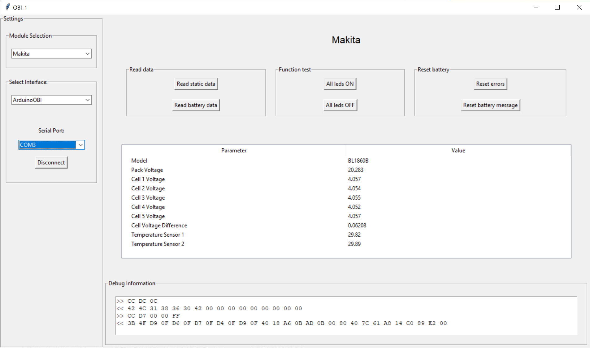

# Makita Battery

Tools to read, diagnose, and attempt repair of the BMS (battery management
system) inside Makita LXT battery packs, using a cheap Arduino/ESP32
interface and a desktop app.

Manufacturers lock the BMS when a fault is detected, to protect the device
and the user — an important safety feature. But protection logic can
false-trigger, or the underlying fault can be temporary or already fixed by
hand. When that happens, throwing away an otherwise-good battery pack just
because its BMS firmware says so is wasteful. This project exists to give
that battery a second opinion.



## What it does

- **Read** the battery's 1-Wire frame: lock state, capacity, cell/model
  info, error byte, and more.
- **Diagnose** whether the pack is currently locked, and why, as far as the
  protocol exposes that.
- **Frame repair**: attempt to clear the lock nibble so the pack can charge
  again.
- **Modular architecture**: battery chemistries/models live under
  `MakitaBattery/modules/` (currently Makita LXT) and communication
  backends under `MakitaBattery/interfaces/` (currently Arduino/1-Wire), so
  more of either can be added independently.

### Important limitations

Frame repair only flips the lock nibble — it does not fix every red/green
blinking-light fault. Some error conditions are recomputed live by the BMS
on every read rather than stored, so clearing them has no lasting effect,
and some fields (like stored capacity) are read-only in practice even
though the write command reports success. If you're investigating a new
battery model or want the details behind these findings, see
[docs/makita-lxt-frame-notes.md](docs/makita-lxt-frame-notes.md).

**Use at your own risk.** Writing to a BMS you don't fully understand can
leave a pack in a worse state than you found it.

---

# Instructions

## Step 1: Set Up ArduinoMakitaBattery

  1. Navigate to the `ArduinoMakitaBattery` folder in the project directory.
  2. Follow the instructions in its [README.md](ArduinoMakitaBattery/README.md). This section will guide you through configuring the Arduino (or ESP32-C3) part of the system, ensuring everything is set up correctly.

## Step 2: Set Up MakitaBattery

After setting up the Arduino part, you have two options for setting up the software on your computer.

### Option 1: Use Precompiled Binary for Windows

If you prefer not to deal with Python dependencies, you can download a precompiled binary for Windows:

  1. Navigate to the Releases section of the repository.
  2. Download the Windows precompiled binary for your system.
  3. Simply run the executable and follow any on-screen instructions to use the software.

### Option 2: Install Python Requirements - Clone the Repository and Install Dependencies

  Clone the repository to your local machine, then navigate into the project folder:
```bash
cd MakitaBattery
```
Install the required Python dependencies:

If you don't have pip installed, follow the installation guide for your platform here.
Install the required libraries by running:
```bash
pip install -r requirements.txt
```
You should now be ready to run MakitaBattery!


## Step 3: Run MakitaBattery

  If you installed the Python version, you can run the program by executing:
```bash
python main.py
```
If you're using the Windows binary, simply double-click the downloaded MakitaBattery.exe file to start the application.

---

## License

Apache License 2.0 — see [LICENSE.md](LICENSE.md).
